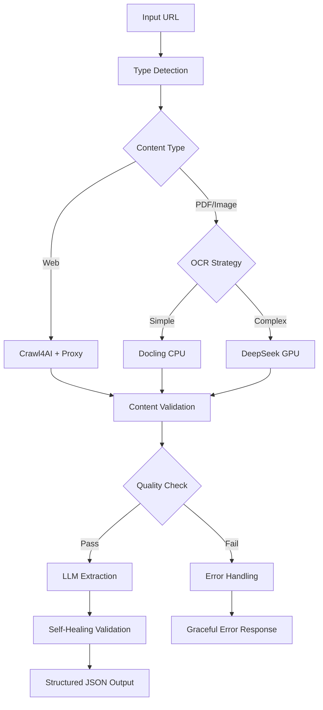

# 🚀 DocuFlow Headless - Universal Document Extraction API

**Agency-Grade Document Intelligence for AI Automation**

[](https://www.python.org/downloads/)
[](https://apify.com)
[](https://opensource.org/licenses/MIT)

## 🎯 What is DocuFlow Headless?

DocuFlow Headless is a robust, API-first extraction engine that transforms unstructured documents (PDFs, images, websites) into structured JSON data. Built for AI automation agencies, it handles edge cases gracefully and provides self-healing validation.

### ✨ Key Features

- **🛡️ Agency-Grade Defense Logic**: Handles login walls, private URLs, huge files, and bad content
- **🧠 Multi-Modal Processing**: Web scraping (Crawl4AI) + Document OCR (Docling/DeepSeek)
- **⚡ Hybrid OCR**: CPU (Docling) + GPU (DeepSeek) for optimal performance
- **🔍 Self-Healing Validation**: Automatic data correction and validation
- **🌐 Apify Integration**: Ready-to-deploy Apify Actor with proxy support
- **🔗 n8n/Make Ready**: Pre-built workflow templates
- **📊 Confidence Scoring**: Reliability metrics for extracted data

## 🏗️ Architecture



## 📦 Installation

### Prerequisites

- Python 3.11+
- Apify account (for deployment)
- Groq API key
- Modal account (optional, for GPU OCR)

### Local Development

```bash
# Clone the repository
git clone https://github.com/docuflow/docuflow-headless.git
cd docuflow-headless

# Create virtual environment
uv venv
source .venv/bin/activate

# Install dependencies
uv pip install -r requirements.txt

# Set up environment variables
cp .env.example .env
# Edit .env with your API keys
```

### Environment Variables

```bash
# Required
GROQ_API_KEY=your_groq_api_key_here

# Optional
MODAL_OCR_ENDPOINT=https://your-modal-endpoint.modal.run
APIFY_PROXY_PASSWORD=your_apify_proxy_password
```

## 🚀 Usage

### Basic Usage

```python
import asyncio
from src.graph import run_extraction

async def extract_data():
    result = await run_extraction(
        source_url="https://example.com/document.pdf",
        target_schema={
            "title": "string",
            "author": "string", 
            "total": "number",
            "items": "array"
        },
        use_gpu_ocr=False
    )
    
    if result["status"] == "success":
        print("Extracted data:", result["final_data"])
        print("Confidence:", result["extraction_confidence"])
    else:
        print("Error:", result["error"])

# Run
asyncio.run(extract_data())
```

### Apify Actor Usage

```json
{
  "source_url": "https://example.com/invoice.pdf",
  "target_schema": {
    "invoice_number": "string",
    "date": "string",
    "total_amount": "number",
    "vendor_name": "string",
    "items": "array"
  },
  "use_gpu_ocr": true,
  "proxy_configuration": {
    "useApifyProxy": true
  }
}
```

## 🛡️ Defense Logic

Our robust defense system handles:

### URL Validation
- ✅ **Accessibility Check**: HEAD requests to verify URL is reachable
- ✅ **Size Limits**: Rejects files >20MB to prevent resource exhaustion
- ✅ **Authentication Detection**: Identifies 401/403 errors early
- ✅ **Content-Type Detection**: Smart type detection with fallback to extension

### Content Quality
- ✅ **Login Wall Detection**: Identifies paywalls, login pages, captchas
- ✅ **Empty Content**: Rejects content <50 characters
- ✅ **Error Page Detection**: Identifies 404, 500, access denied pages
- ✅ **HTML Remnant Cleaning**: Removes excessive JavaScript/CSS artifacts

### Processing Resilience
- ✅ **Retry Logic**: Exponential backoff for transient failures
- ✅ **Proxy Fallback**: Tries without proxy if initial attempts fail
- ✅ **Timeout Handling**: Comprehensive timeout management
- ✅ **Graceful Degradation**: Falls back to simpler methods when needed

## 🔧 Configuration

### Crawl4AI Configuration
```python
browser_config = BrowserConfig(
    headless=True,
    proxy=proxy_url,  # Apify proxy integration
    user_agent="DocuFlow-Bot/1.0"
)
```

### OCR Configuration
```python
# CPU Processing (Docling)
pipeline_options = PdfPipelineOptions()
pipeline_options.do_ocr = True
pipeline_options.do_table_structure = True

# GPU Processing (DeepSeek)
use_gpu_ocr = True  # For complex documents
```

### LLM Configuration
```python
# Groq LLM with low temperature for consistency
llm = ChatGroq(
    model="llama-3.1-70b-versatile",
    temperature=0.1,
    max_tokens=4096
)
```

## 📊 Output Format

### Success Response
```json
{
  "status": "success",
  "data": {
    "title": "Invoice #12345",
    "total_amount": 150.50,
    "date": "2024-01-15",
    "vendor_name": "Acme Corp"
  },
  "confidence": 0.95,
  "validation_passed": true,
  "errors": [],
  "warnings": [],
  "suggestions": ["Consider extracting tax information"]
}
```

### Error Response
```json
{
  "status": "failed",
  "error": "URL is private (Status 403)",
  "data": null,
  "input": {
    "source_url": "https://private.example.com/doc.pdf"
  }
}
```

## 🧪 Testing

### Test Unhappy Paths
```bash
# Test private URL
python -m src.main << 'EOF'
{
  "source_url": "http://httpstat.us/403",
  "target_schema": {"test": "string"}
}
EOF

# Test large file
python -m src.main << 'EOF'
{
  "source_url": "https://example.com/huge-file.pdf",
  "target_schema": {"test": "string"}
}
EOF

# Test login wall
python -m src.main << 'EOF'
{
  "source_url": "https://example.com/login-required",
  "target_schema": {"test": "string"}
}
EOF
```

### Test Happy Paths
```bash
# Test PDF processing
python -m src.main << 'EOF'
{
  "source_url": "https://www.w3.org/WAI/ER/tests/xhtml/testfiles/resources/pdf/dummy.pdf",
  "target_schema": {"title": "string", "pages": "number"}
}
EOF

# Test web scraping
python -m src.main << 'EOF'
{
  "source_url": "https://example.com",
  "target_schema": {"title": "string", "headings": "array"}
}
EOF
```

## 🔗 n8n Integration

Import the provided workflow template:

1. Open n8n
2. Go to Workflows → Import
3. Select `templates/n8n_workflow.json`
4. Configure the HTTP Request node with your Apify Actor URL
5. Set up credentials for API authentication

### n8n Workflow Features
- ✅ **Error Handling**: Automatic success/failure detection
- ✅ **Data Formatting**: Structured output formatting
- ✅ **Retry Logic**: Built-in retry mechanisms
- ✅ **Validation**: Input validation and sanitization

## 🚀 Deployment

### Apify Deployment
```bash
# Install Apify CLI
npm install -g apify-cli

# Login to Apify
apify login

# Push to Apify
apify push

# Test the actor
apify call -i '{"source_url": "https://example.com", "target_schema": {"title": "string"}}'
```

### Modal Deployment (GPU OCR)
```bash
# Install Modal
pip install modal

# Deploy GPU backend
modal deploy modal_backend/gpu_ocr.py

# Get endpoint URL
modal list
```

### Docker Deployment
```bash
# Build image
docker build -t docuflow-headless -f .actor/Dockerfile .

# Run container
docker run -e GROQ_API_KEY=your_key docuflow-headless
```

## 📈 Performance

### Benchmarks
- **Web Scraping**: ~2-5 seconds per page
- **PDF Processing**: ~5-15 seconds per document
- **GPU OCR**: ~10-30 seconds per complex document
- **LLM Extraction**: ~3-8 seconds per extraction

### Optimization Tips
1. **Use CPU OCR** for simple, text-based PDFs
2. **Enable GPU OCR** only for complex scans/handwriting
3. **Configure proxies** for high-volume web scraping
4. **Set appropriate timeouts** based on document size
5. **Use batch processing** for multiple documents

## 🔍 Monitoring & Debugging

### Structured Logging
All modules use structured logging for easy debugging:
```json
{
  "event": "content_extraction",
  "url": "https://example.com",
  "content_length": 15234,
  "processing_time": 2.34,
  "confidence": 0.95
}
```

### Health Checks
```bash
# Check service health
curl -X POST https://your-modal-endpoint.modal.run/health_check

# Expected response
{
  "status": "healthy",
  "gpu_available": true,
  "gpu_count": 1
}
```

## 🤝 Contributing

1. Fork the repository
2. Create a feature branch
3. Add tests for new functionality
4. Ensure all tests pass
5. Submit a pull request

### Development Setup
```bash
# Install development dependencies
uv pip install pytest pytest-asyncio pytest-cov black flake8 mypy

# Run tests
pytest tests/ -v --cov=src

# Format code
black src/ tests/

# Type checking
mypy src/
```

## 📄 License

MIT License - see [LICENSE](LICENSE) file for details.

## 🆘 Support

- **Documentation**: [https://docs.docuflow.ai](https://docs.docuflow.ai)
- **Issues**: [GitHub Issues](https://github.com/docuflow/docuflow-headless/issues)
- **Discord**: [Join our community](https://discord.gg/docuflow)
- **Email**: support@docuflow.ai

## 🙏 Acknowledgments

- [Crawl4AI](https://github.com/unclecode/crawl4ai) - Web scraping engine
- [Docling](https://github.com/docling-project/docling) - Document processing
- [LangGraph](https://github.com/langchain-ai/langgraph) - Workflow orchestration
- [Groq](https://groq.com) - Fast LLM inference
- [Modal](https://modal.com) - GPU compute platform
- [Apify](https://apify.com) - Actor platform and proxies

---

**Built with ❤️ for AI Automation Agencies**