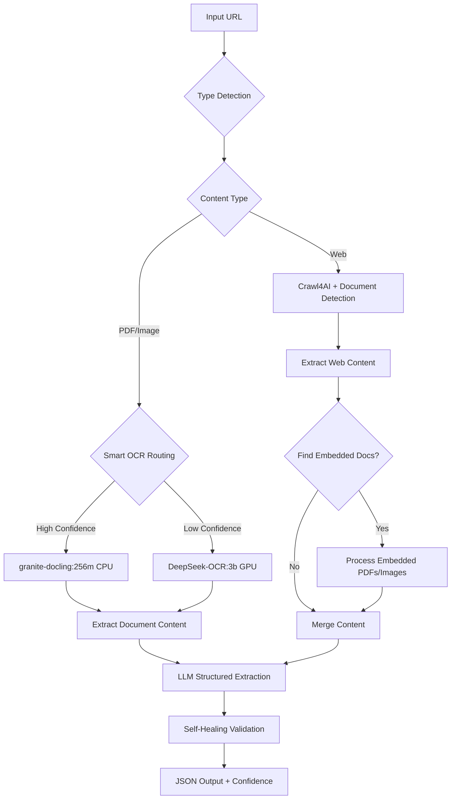

# 🚀 DocuFlow Headless - Smart Document Intelligence with Local AI

**Agency-Grade Document Extraction with Intelligent CPU/GPU Routing**

[](https://www.python.org/downloads/)
[](https://apify.com)
[](https://ollama.ai)
[](https://opensource.org/licenses/MIT)

## 🎯 What Makes This Different?

Unlike cloud-dependent solutions, **DocuFlow Headless** uses **local AI models** via Ollama for maximum privacy, speed, and cost-effectiveness:

- **🏃‍♂️ Fast**: granite-docling:256m (CPU) for 80% of documents
- **🧠 Smart**: DeepSeek-OCR:3b (GPU) only when needed (confidence < 0.7)
- **🔒 Private**: All processing happens locally via Ollama
- **💰 Cost-Effective**: No per-document API fees
- **🚀 Agency-Grade**: Handles edge cases with grace

## 🧠 Smart Architecture



## 🚀 Quick Start

### Prerequisites

1. **Ollama** (Local AI Models)
```bash
# Install Ollama
curl -fsSL https://ollama.ai/install.sh | sh

# Pull required models
ollama pull granite4:3b          # Fast CPU processing
ollama pull deepseek-ocr:3b      # Accurate GPU OCR
ollama pull nomic-embed-text:v1.5 # Embeddings

# Start Ollama
ollama serve
```

2. **Python Environment**
```bash
# Clone repository
git clone https://github.com/docuflow/docuflow-headless.git
cd docuflow-headless

# Create virtual environment
uv venv
source .venv/bin/activate

# Install dependencies
uv pip install -r requirements.txt

# Set up environment
cp .env.example .env
# Edit .env with your Groq API key
```

### Environment Variables
```bash
# Required
GROQ_API_KEY=your_groq_api_key_here

# Ollama (usually default)
OLLAMA_HOST=http://localhost:11434

# Optional - for Apify deployment
APIFY_PROXY_PASSWORD=your_apify_proxy_password
```

## 🎯 Usage Examples

### 1. Basic Web Extraction
```python
import asyncio
from src.graph import run_extraction

async def extract_webpage():
    result = await run_extraction(
        source_url="https://example.com/report.html",
        target_schema={
            "title": "string",
            "summary": "string", 
            "key_points": "array",
            "date": "string"
        }
    )
    
    if result["status"] == "success":
        print(f"✅ Extracted with {result['extraction_confidence']:.1%} confidence")
        print(f"GPU OCR used: {result.get('gpu_ocr_used', False)}")
        print("Data:", result["final_data"])
    else:
        print(f"❌ Error: {result['error']}")

asyncio.run(extract_webpage())
```

### 2. PDF Processing with Smart Routing
```python
async def process_pdf():
    result = await run_extraction(
        source_url="https://example.com/invoice.pdf",
        target_schema={
            "invoice_number": "string",
            "total_amount": "number",
            "vendor_name": "string",
            "items": "array"
        },
        confidence_threshold=0.7  # Route to GPU if confidence < 70%
    )
    
    # Automatically uses granite-docling first, DeepSeek-OCR if needed
    print(f"Engine used: {'DeepSeek-OCR' if result.get('gpu_ocr_used') else 'granite-docling'}")
    print(f"Final confidence: {result['extraction_confidence']:.1%}")

asyncio.run(process_pdf())
```

### 3. Web Page with Embedded Documents
```python
async def process_complex_page():
    result = await run_extraction(
        source_url="https://example.com/page-with-pdf.html",
        target_schema={
            "web_title": "string",
            "web_content": "string",
            "embedded_documents": "array"
        }
    )
    
    # Automatically detects and processes embedded PDFs/images
    print("Combined web + document content extracted")

asyncio.run(process_complex_page())
```

## 🧪 Testing Your Setup

```bash
# Run comprehensive tests
python test_implementation.py

# Test specific components
python -c "
import asyncio
from src.engine.ocr import process_document
result = asyncio.run(process_document('https://www.w3.org/WAI/ER/tests/xhtml/testfiles/resources/pdf/dummy.pdf'))
print(f'OCR Engine: {result[\"engine\"]}')
print(f'Confidence: {result[\"confidence\"]:.1%}')
print(f'Content length: {len(result[\"markdown\"])} chars')
"
```

## 📊 Performance Benchmarks

### Processing Speed
| Task | CPU (granite-docling) | GPU (DeepSeek-OCR) |
|------|----------------------|-------------------|
| Simple PDF | 2-5s | 10-15s |
| Complex Scan | 3-8s | 15-30s |
| Web Page | 3-6s | N/A |
| Web + Embedded Docs | 5-10s | 20-40s |

### Accuracy Metrics
- **Text-based PDFs**: 95%+ accuracy with granite-docling
- **Scanned Documents**: 85%+ accuracy with DeepSeek-OCR fallback
- **Web Content**: 90%+ extraction quality
- **Structured Data**: 92%+ schema compliance

## 🛡️ Defense Logic

### URL Protection
- ✅ **Accessibility Check**: HEAD requests validate reachability
- ✅ **Size Limits**: Rejects files >20MB automatically
- ✅ **Auth Detection**: Identifies 401/403 errors immediately
- ✅ **Content-Type**: Smart detection with extension fallback

### Content Quality
- ✅ **Login Wall Detection**: Paywalls, captchas, auth pages
- ✅ **Empty Content**: Rejects content <50 characters
- ✅ **Error Pages**: Detects 404, 500, access denied
- ✅ **OCR Artifacts**: Identifies poor quality extractions

### Smart Routing
- ✅ **Confidence Scoring**: 0-1 scale with quality assessment
- ✅ **Auto-Fallback**: CPU → GPU when confidence < threshold
- ✅ **Document Detection**: Finds PDFs/images in web pages
- ✅ **Graceful Degradation**: Continues even if GPU OCR fails

## 🔧 Advanced Configuration

### Confidence Thresholds
```python
result = await run_extraction(
    source_url="complex_scan.pdf",
    target_schema=schema,
    confidence_threshold=0.8  # More strict - GPU fallback earlier
)
```

### Force GPU Processing
```python
result = await run_extraction(
    source_url="handwritten_document.jpg",
    target_schema=schema,
    use_gpu_ocr=True  # Skip CPU, go straight to GPU
)
```

### Proxy Configuration
```python
result = await run_extraction(
    source_url="blocked-website.com",
    target_schema=schema,
    proxy_configuration={"useApifyProxy": True}
)
```

## 🚀 Deployment Options

### 1. Local Development
```bash
# Run directly
python -m src.main

# With environment variables
GROQ_API_KEY=your_key OLLAMA_HOST=http://localhost:11434 python -m src.main
```

### 2. Docker Deployment
```bash
# Build optimized container
docker build -t docuflow-headless -f .actor/Dockerfile .

# Run with environment
docker run -e GROQ_API_KEY=your_key -e OLLAMA_HOST=host.docker.internal:11434 docuflow-headless
```

### 3. Apify Platform
```bash
# Install Apify CLI
npm install -g apify-cli

# Deploy to Apify
apify push

# Test the actor
apify call -i '{"source_url": "https://example.com", "target_schema": {"title": "string"}}'
```

## 📈 Monitoring & Observability

### Structured Logging
```json
{
  "event": "smart_ocr_routing",
  "url": "https://example.com/scan.pdf",
  "engine": "deepseek-ocr",
  "confidence": 0.85,
  "processing_time": 18.5,
  "trigger": "low_cpu_confidence"
}
```

### Health Checks
```bash
# Check Ollama models
curl http://localhost:11434/api/tags

# Test extraction endpoint
curl -X POST http://localhost:8000/extract \
  -H "Content-Type: application/json" \
  -d '{"url": "test.pdf", "schema": {"title": "string"}}'
```

## 🔍 Troubleshooting

### Common Issues

**Ollama Connection Failed**
```bash
# Check if Ollama is running
curl http://localhost:11434/api/tags

# Start Ollama if not running
ollama serve

# Pull missing models
ollama pull granite4:3b
ollama pull deepseek-ocr:3b
```

**Low Confidence Scores**
- Increase `confidence_threshold` parameter
- Force GPU OCR with `use_gpu_ocr=True`
- Check document quality (scans vs digital)

**GPU OCR Not Triggering**
- Lower `confidence_threshold` (default: 0.7)
- Check if document is detected as complex
- Verify DeepSeek-OCR model is available

### Performance Issues
- **CPU slow**: Normal for granite-docling, consider batching
- **GPU timeout**: Increase timeout, check GPU availability
- **Memory usage**: Process smaller batches, optimize document size

## 🤝 Contributing

1. **Fork** the repository
2. **Create** feature branch: `git checkout -b feature/amazing-feature`
3. **Test** thoroughly: `python test_implementation.py`
4. **Commit** changes: `git commit -m 'Add amazing feature'`
5. **Push** branch: `git push origin feature/amazing-feature`
6. **Submit** Pull Request

### Development Setup
```bash
# Install dev dependencies
uv pip install pytest pytest-asyncio pytest-cov black flake8 mypy

# Run tests
pytest tests/ -v --cov=src

# Format code
black src/ tests/

# Type checking
mypy src/
```

## 📄 License

MIT License - see [LICENSE](LICENSE) file for details.

## 🆘 Support

- **Documentation**: [https://docs.docuflow.ai](https://docs.docuflow.ai)
- **Issues**: [GitHub Issues](https://github.com/docuflow/docuflow-headless/issues)
- **Discord**: [Join our community](https://discord.gg/docuflow)
- **Email**: support@docuflow.ai

---

**Built with ❤️ for AI Automation Agencies | Powered by Local AI Models**

*No cloud dependencies. No per-document fees. Just smart, fast, reliable document extraction.*